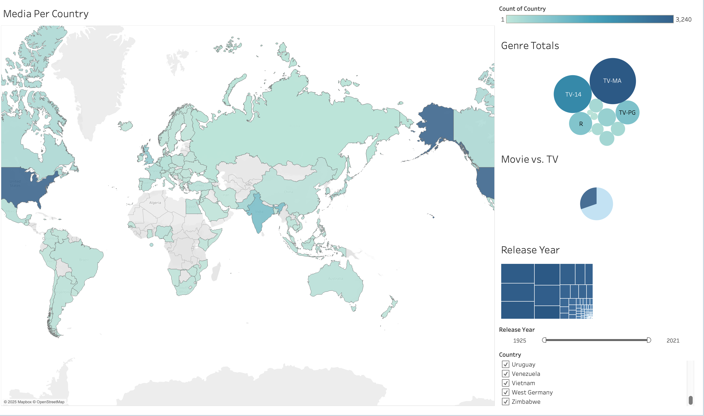
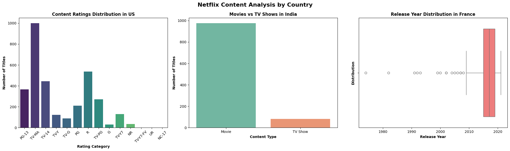
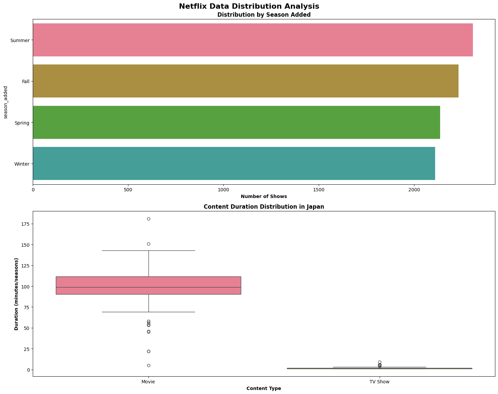

# 📊 EDA: Netflix Dataset

Welcome to the first addition to my data science portfolio — an **Exploratory Data Analysis (EDA)** of the [Netflix Dataset](https://www.kaggle.com/datasets/ariyoomotade/netflix-data-cleaning-analysis-and-visualization) from Kaggle.

My goal throughout this project is to answer the question: **"What questions about Netflix content strategy can I answer with this dataset?”**

# My main takeaways from this casestudy / project were this:
• The United States (3240) has the most media on Netflix followed by India (1057)
• TV-MA was the most frequent rating of all Netflix media (3,205) and NC-17 & UR being the least (3)
• Japan has an average TV duration of 1.7 seasons and Movie duration of 97.6 minutes.
• Netflix adds its media most in the summer time (2309) and Winter the least (2211).
• The average release year for media in France is 2016 (2015.75)

From my analysis techniques I could find a number of insights from each country or other demographics, this is simply a display of the skills I have.

Through this project, I demonstrate my ability to:
- 🔴 **Clean and preprocess** real-world data from **Kaggle**
- 🔵 **Visualize** data to uncover patterns and insights in **Tableau, Jupyter Notebooks, Pandas, Matplotlib, Seaborn** 

---

! [Netflix Dashboard](./easy.png)

## 🛠 Tools & Environment

- **Jupyter Notebooks**  
- **Python**: pandas, matplotlib, seaborn, plotly  
- **Notebook environment**: VS Code / JupyterLab  
- **Dashboarding Software**: Tableau Public

---

## 📫 Contact Me

If you have any questions or feedback, feel free to reach out:

- 📧 Email: [andrewjhlava@gmail.com](mailto:andrewjhlava@gmail.com)  
- 🌐 Website: [andrewhlavacek.github.io](https://andrewhlavacek.github.io/)

---

Thank you for checking out my work!
